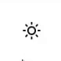

# use-dark-mode-hook


A simple library to add dark mode functionality to your React projects!



This library provides a custom hook `useDarkMode` and a button toggler component `DarkModeToggler`. You can use them together or use a different button toggler component. However, this library does **not** provide any styling regarding dark and light mode. You have to do that yourself.

By default, `useDarkMode` will apply either `dark` or `light` class to the `body` of the document based on the choice of the user.

## Contents

- [Installation](#installation)
- [Usage](#usage)
- [useDarkMode + DarkModeToggler](#usedarkmode--darkmodetoggler)
- [useDarkMode hook](#usedarkmode-hook)
    - [Options](#options)
- [DarkModeToggler](#darkmodetoggler)
    - [Options](#options-1)
- [Attribution](#attribution)
- [License](#license)

## Installation

in your terminal:

```
npm i use-dark-mode-hook
```

## Usage

### useDarkMode + DarkModeToggler

To use both the functionality and UI (more details about the options of each in below sections):

```js
import useDarkMode, { DarkModeToggler } from 'use-dark-mode-hook'

function MyComponent () {
    const [isDarkMode, toggleDarkMode] = useDarkMode()

    return (
        <DarkModeToggler 
            isDarkMode={isDarkMode} 
            toggleDarkMode={toggleDarkMode}
            buttonClassName="some-classes"
        />
    )
}
```

### useDarkMode hook

```js
import useDarkMode from 'use-dark-mode-hook'

function myComponent (props) {
    const [isDarkMode, toggleDarkMode] = useDarkMode()

    //do something with it
}
```

**isDarkMode**: boolean state for whether dark mode is chosen or not
**toggleDarkMode**: function that takes boolean value for whether dark mode should be enabled or not. Use this to change the user's preference (dark or light mode).

#### Options

You can pass to `useDarkMode` the following options:

| Name           | Type    | Description                                                     | Default |
| -------------- | ------- | --------------------------------------------------------------- | ------- |
| initialValue   | boolean | should it initially be dark                                     | false   |
| darkModeClass  | string  | the class that should be given when dark mode                   | dark    |
| lightModeClass | string  | the class that should be given when light mode                  | light   |
| element        | string  | the selector of the element that the class should be applied to | body    |

```js
useDarkMode({
    initialValue: false,
    darkModeClass: 'dark',
    lightModeClass: 'light',
    element: 'body'
})
```


### DarkModeToggler

```js
import { DarkModeToggler } from 'use-dark-mode-hook'

function MyComponent () {
    //some code

    function toggleDarkMode () {
        //logic to toggle dark mode
    }

    return (
        <DarkModeToggler isDarkMode={value} toggleDarkMode={toggleDarkMode}>
        </DarkModeToggler>
    )
}
```

If you use the button only for toggling dark mode, you need to pass it the following parameters:

#### Options

| Name            | Type             | Description                                                    |
| --------------- | ---------------- | -------------------------------------------------------------- |
| isDarkMode      | boolean          | Whether it's currently dark or light                           |
| toggleDarkMode  | Function         | The function that will handle the change of login between dark |
|                 |                  | and light mode. Takes boolean as parameter for whether dark is |
|                 |                  | enabled or not.                                                |
| buttonClassName | string(optional) | custom class to assign to button                               |


---

## Attribution

Icons from [Feather](https://feathericons.com/).

---

## License

[MIT](./LICENSE)